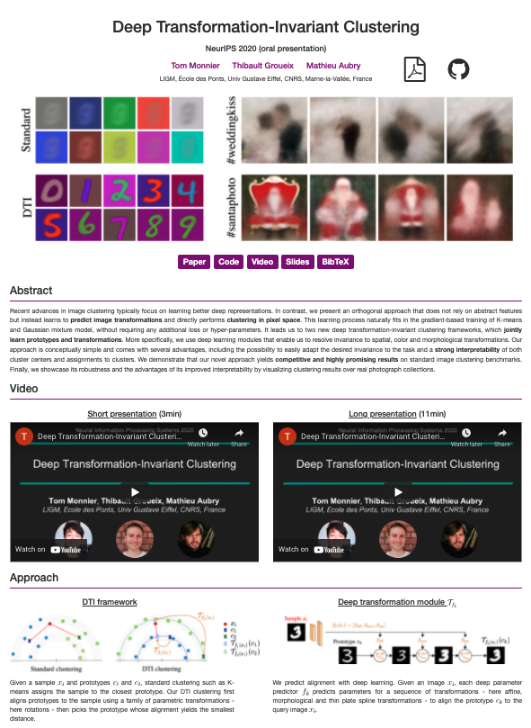

# project-webpage

This is a template for a project webpage. You are welcome to use it to present your exciting 
works, please attribute its source with a link back to this repository. An example of use can 
be found [here](http://imagine.enpc.fr/~monniert/DTI-Sprites/).



## How to use :rocket:

1. clone the repository on a public server

```
git clone https://github.com/monniert/project-webpage.git
```

2. modify `index.html` to put your project content
3. modify `style.css` with your favorite theme settings, e.g. replace all the main color
entries from its default hex value `#800084` to another value.

Feel free to open an issue if you have remarks/questions.
